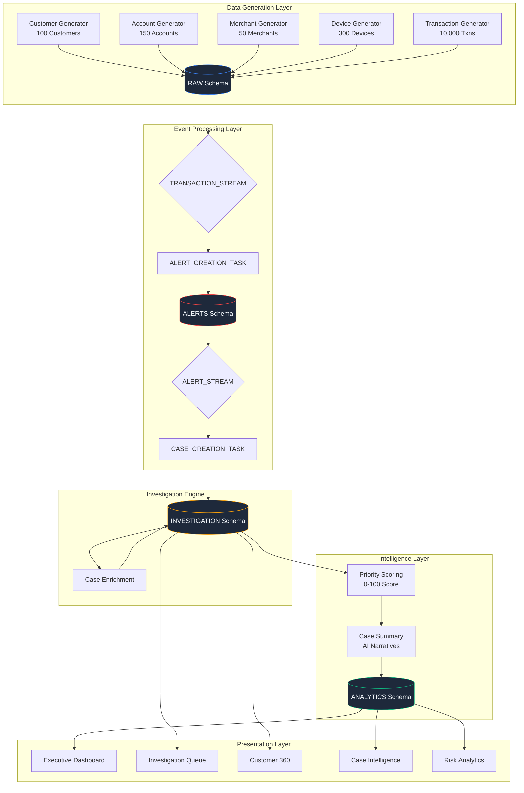
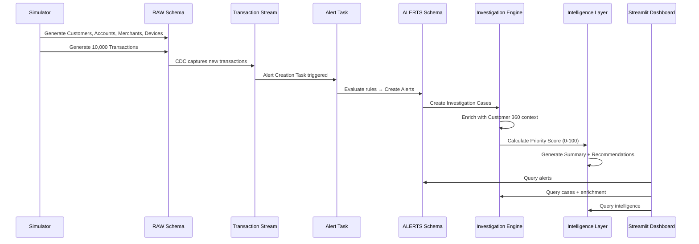
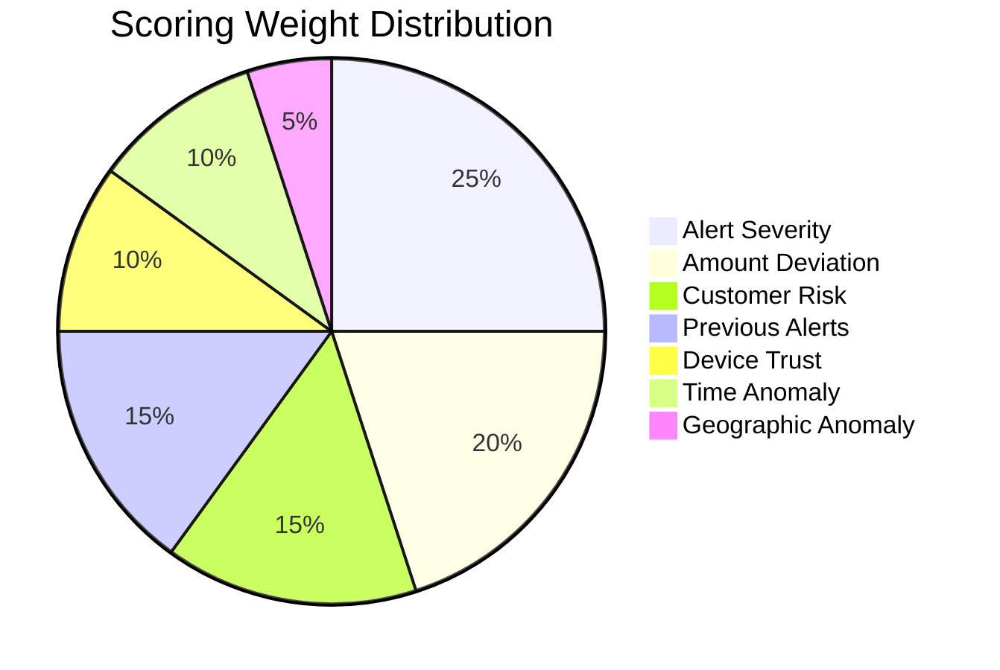

# CasePilot — System Architecture

## Overview

CasePilot is an **AI-Powered Financial Investigation Copilot** that automates post-alert investigation workflows. It does NOT detect fraud — it starts **after** an alert is generated and creates investigation-ready cases with enrichment, intelligence, and priority scoring.

## Architecture Diagram

## Data Flow

## Snowflake Schema Design

| Schema | Purpose | Tables |
|--------|---------|--------|
| **RAW** | Landing zone for transactional data | CUSTOMER, ACCOUNT, MERCHANT, DEVICE, TRANSACTION |
| **CORE** | Curated analytical layer | (Reserved for views) |
| **ALERTS** | Alert generation & management | ALERT |
| **INVESTIGATION** | Case management & enrichment | INVESTIGATION_CASE, CASE_ENRICHMENT |
| **ANALYTICS** | Intelligence & scoring | CASE_INTELLIGENCE |

## Priority Scoring Algorithm

| Risk Band | Score Range | Action |
|-----------|------------|--------|
| LOW | 0–25 | Routine review |
| MEDIUM | 26–50 | 48-hour investigation |
| HIGH | 51–75 | Same-day priority |
| CRITICAL | 76–100 | Immediate escalation |

## Alert Rules

| Rule | Trigger Condition | Default Severity |
|------|------------------|-----------------|
| HIGH_VALUE_TXN | Amount > ₹25,000 | MEDIUM–CRITICAL |
| ODD_HOUR_ACTIVITY | 00:00–04:00 hours | MEDIUM |
| NEW_DEVICE_USED | Untrusted device | HIGH |
| RAPID_TXN_BURST | 5+ txns in 10 min | HIGH |
| FOREIGN_ACTIVITY | Outside India | HIGH |
